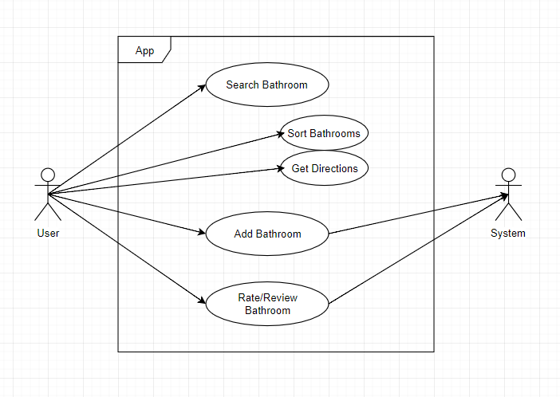

## Stakeholder Interviews
What platforms are we designing for?
> Mobile: Android and iOS

What worries your about this project?
> User generated data is a risk to trustworthiness. Perhaps you could implement a user reviewed trust system?

Anything you would like to include?
> Perhaps some function of localizing the results. If I'm near NYU maybe I want to see NYU bathrooms.

Tech-stack
> React Native, JS, AWS Amplify, DynamoDB

## End-user observation
1. John Doe urgently needs to use the bathroom
	* Needs to find the nearest bathroom as fast as possible
		* app can have a one tap "find nearest bathroom" feature
2. Jane Doe is a mother who needs to take care of her young child's needs
	* Needs to find a clean bathroom with the facilities she needs 
		* app can allow users to 'tag' bathrooms with what facilities can be used inside
		* user can then filter the results to suit their needs
3. John Doe is looking for a bathroom
	* Wants to know if the bathroom actually exists
		* app can have a upvote/downvote percentage peer trustworthiness system - the higher the percent the better
		* app can also allow users to leave reviews or instructions on how to get to the bathroom

## Use Cases
**Title:** Find nearest bathroom\
**Actor:** App user\
**Scenario:** User presses "find nearest bathroom". User selects usage needs. System finds nearest bathrooms to location. User selects bathroom from list/locations provided. User receives map directions to location. 

**Title:** Search bathrooms near user (location data given)\
**Actor:** App user\
**Scenario:** User presses "find bathrooms near me" after pressing into search bar. System provides all bathrooms within some radius. User can choose to filter results using categories/tags. 

**Title:** Search bathrooms near location\
**Actor:** App user\
**Scenario:** User taps into search bar. User inputs address/zipcode. System provides all bathrooms within some radius of given location. User can filter results using  categories/tags.

**Title**: User selects bathroom\
**Actor**: App user\
**Scenario**: User has decided on a bathroom he/she wants to use. User taps location marker. System provides facilities available at location, ratings, reviews, in-depth directions and description. 

**Title**: User needs directions to bathroom\
**Actor**: App user\
**Scenario**: User selects "directions" when in specific bathroom location marker. System provides Google Maps routing to location. System provides on-premise bathroom location directions if available (top upvoted user description/review). Navigation stops when user taps "found" button. 

**Title**: Add location\
**Actor**: App user\
**Scenario**: User selects "add bathroom". System prompts for address or current location data. If user chooses current location data, system uses current location of user. If user chooses address, system prompts user to enter address. System prompts user for in building walking instructions. System prompts user for rating if applicable.

**Title**: Rate location trust\
**Actor**: App user\
**Scenario**: User taps into location. Systems provides “check” and “x” mark. User taps “check” if he found the location. User taps “x” if he didn’t find the location. System tallies votes from users and gives the location a trustworthiness rating out of 100%.

**Title**: Review location\
**Actor**: App user\
**Scenario**: User taps location. System brings up location screen. User taps "review location". System allows user to enter anonymous review for the location.

**Title**: Update location\
**Actor**: App user\
**Scenario**: User taps location. User wants to add tags to the location. System allows for repeat adds of the same tag. User adds tags. System keeps track of tags and tallies them. System displays tags in order of tallies. (e.g. multiple users tag the same location with “busy”. “busy” becomes the top tag so others know the bathroom receives a lot of traffic)

**Title**: Flag bad location\
**Actor**: App user\
**Scenario**: If a user finds that a marked bathroom location doesn’t exist or has been removed. The user can press "flag bad location" button to alert the system to remove the location. 

**Title**: View by best rating\
**Actor**: App user\
**Scenario**: If a user sets “Sort by rating”, the bathrooms will be listed from the best to worst ratings. The user should be able to set a distance to show the best bathrooms in a given radius.

**Title**: Sort bathrooms\
**Actor**: App user\
**Scenario**: The user selects tags to sort the bathrooms listed. System changes listed bathrooms to fits the tags selected by the user.

## Domain Modeling

